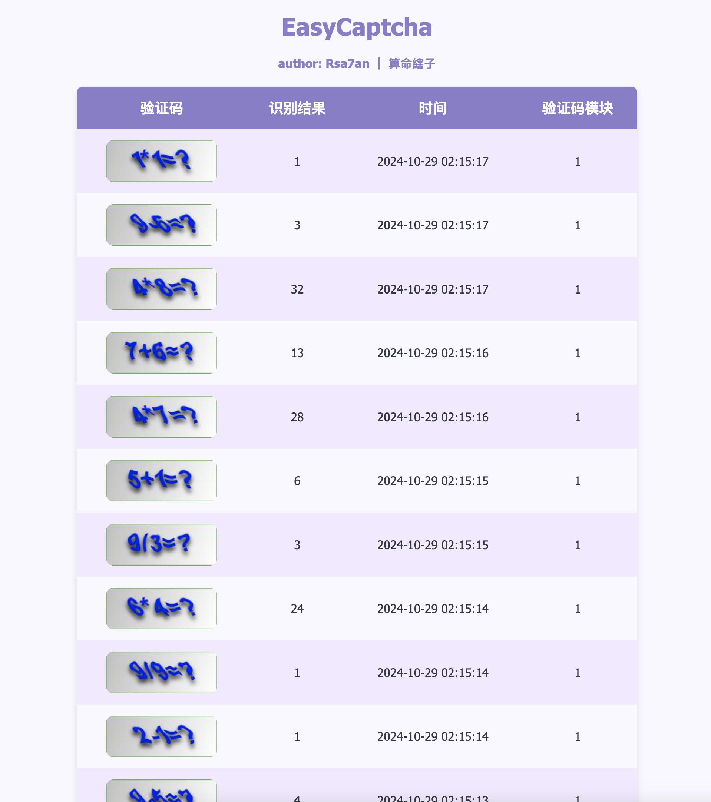
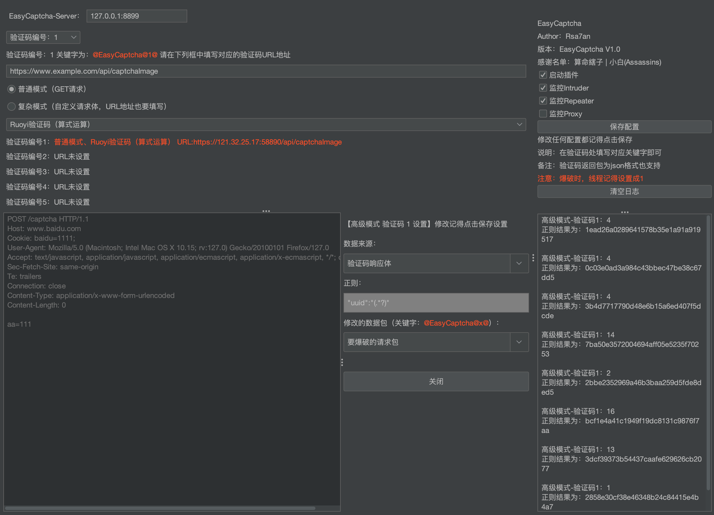

# EasyCaptcha

## 项目简介

EasyCaptcha 是基于 [xp_CAPTCHA（瞎跑-白嫖版）](https://github.com/smxiazi/xp_CAPTCHA) 的二次开发项目。该项目增加了 Ruoyi 计算验证码识别功能，准确率高达 100%。同时，对 Server 端和 Burp Suite 端的用户界面进行了优化，使其更加美观和易用。

## 功能特点

- **Ruoyi 验证码识别**：接入训练好的模型文件，增加 Ruoyi 计算验证码识别，确保 100% 准确率。

- **界面优化**：对 Server 端和 Burp Suite 端的 UI 进行了全面优化，提升用户体验。

  

  

## 使用教程

- **使用教程：**[burp 验证码识别插件 xp_CAPTCHA V4.1(瞎跑-白嫖版) // 算命縖子 (nmd5.com)](http://www.nmd5.com/posts/2022-06-26-29/)

## 致谢

- **感谢 [算命縖子](https://github.com/smxiazi)**，提供了基础项目 xp_CAPTCHA 的代码和灵感。

## 贡献

欢迎提交 Pull Request 或者 Issues。

## 许可证

Apache License 2.0. © Rsa7an

## 